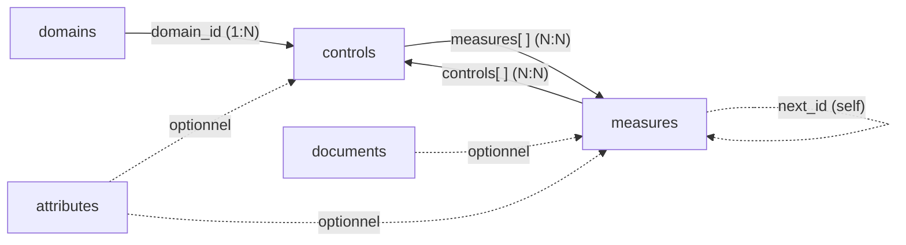
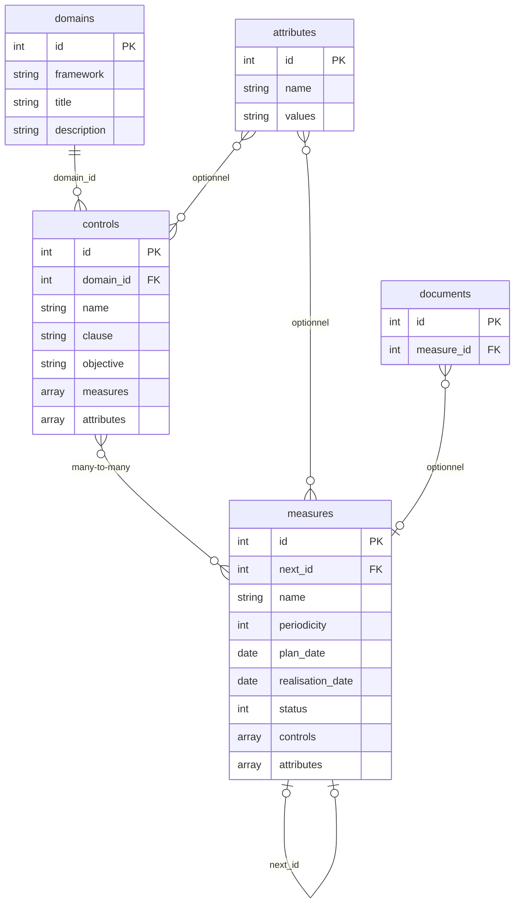

# Modèle de données

Les tables clés sont les suivantes :

- attributes
- domains
- controls
- measures
- documents

> **Rôles :** `controls` = **mesures de sécurité** (exigences à mettre en œuvre).  
> `measures` = **instances d'audit** (vérifications périodiques de ces exigences).

## Dépendances entre tables

Vue d'ensemble : qui utilise quoi.



Le schéma détaillé ci-dessous décrit les champs de chaque table.



Les relations sont les suivantes :

| Lien | Type | Description |
| --- | --- | --- |
| `domains` → `controls` | Clé étrangère (1:N) | Chaque mesure de sécurité référence son domaine via `domain_id` |
| `controls` ↔ `measures` | Many-to-many (bidirectionnel) | Chaque mesure de sécurité liste ses instances d'audit dans `measures[]` ; chaque instance d'audit liste ses mesures de sécurité dans `controls[]` |
| `attributes` → `controls` | Optionnel | Le champ `attributes` d'une mesure de sécurité peut contenir une liste d'IDs d'attributs |
| `attributes` → `measures` | Optionnel | Idem pour les instances d'audit |
| `measures` → `measures` | Auto-référence via `next_id` | Permet de chaîner les campagnes successives d'un même audit |
| `documents` → `measures` | Optionnel (1:N) | Les documents et preuves sont attachés aux instances d'audit via `measure_id` |

> **Note :** il n'y a pas de table de jonction exposée pour la relation controls/measures.  
> Les IDs sont directement embarqués dans chaque objet des deux côtés.

---

## attributes

Les attributs sont des référentiels de classification multi-valeurs.  
Chaque attribut définit un ensemble de tags (préfixés `#`) qui peuvent être associés aux mesures de sécurité et aux instances d'audit.

| Champ | Type | Description |
| --- | --- | --- |
| `id` | integer | Identifiant unique (PK) |
| `name` | string | Intitulé de la taxonomie (ex : *Security measures*, *Risk_Level*) |
| `values` | string | Liste de valeurs possibles séparées par des espaces, chacune préfixée `#` (ex : `#Preventive #Detective #Corrective`) |
| `created_at` | datetime | Date de création (ISO 8601, UTC) |
| `updated_at` | datetime | Date de dernière modification |

Exemple :

```json
{
  "id": 1,
  "name": "Security measures",
  "values": "#Preventive #Detective #Corrective",
  "created_at": "2026-05-17T20:35:52.000000Z",
  "updated_at": "2026-05-17T20:35:52.000000Z"
}
```

---

## domains

Les domaines regroupent les mesures de sécurité par thématique.  
Chaque domaine appartient à un cadre réglementaire ou méthodologique (`framework`).

| Champ | Type | Description |
| --- | --- | --- |
| `id` | integer | Identifiant unique (PK) |
| `framework` | string | Référentiel d'appartenance (ex : `NIS2`, `Vulnerability Management`) |
| `title` | string | Nom du domaine (ex : *Pilotage et Gouvernance NIS2*) |
| `description` | string | Description du périmètre couvert, souvent avec référence à l'article ou à la norme |
| `created_at` | datetime | Date de création |
| `updated_at` | datetime | Date de dernière modification |

Exemple :

```json
{
  "id": 1,
  "framework": "NIS2",
  "title": "Pilotage et Gouvernance NIS2",
  "description": "Pilotage stratégique et opérationnel selon Art. 21.1 et 21.2.a",
  "created_at": "2026-05-17T20:35:52.000000Z",
  "updated_at": "2026-05-17T20:35:52.000000Z"
}
```

---

## controls

Les mesures de sécurité décrivent les exigences à mettre en œuvre.  
Chaque mesure de sécurité appartient à un domaine et est vérifiée par une ou plusieurs instances d'audit.

| Champ | Type | Description |
| --- | --- | --- |
| `id` | integer | Identifiant unique (PK) |
| `domain_id` | integer | Référence vers `domains.id` (FK, obligatoire) |
| `name` | string | Nom de la mesure, souvent avec le numéro d'article (ex : *Art.21.2.a - Analyse de Risques*) |
| `clause` | string | Identifiant court de la clause normative (ex : `NIS2-Art.21.2.a`) |
| `objective` | string | Objectif attendu par cette mesure de sécurité |
| `input` | string \| null | Données ou ressources nécessaires à la mise en œuvre |
| `model` | string \| null | Modèle ou méthode opérationnelle recommandée |
| `indicator` | string \| null | Indicateur de performance structuré (Target, Frequency, Owner) |
| `action_plan` | string \| null | Plan d'action ou traitement associé |
| `standard` | string \| null | Référence à une norme externe (ex : ISO 27001) |
| `attributes` | array \| null | Liste d'IDs d'attributs associés ; `null` si aucun |
| `measures` | array | Liste des IDs d'instances d'audit qui vérifient cette mesure de sécurité |
| `created_at` | datetime | Date de création |
| `updated_at` | datetime | Date de dernière modification |

Exemple :

```json
{
  "id": 1,
  "domain_id": 1,
  "name": "Art.21.2.a - Analyse de Risques",
  "clause": "NIS2-Art.21.2.a",
  "objective": "Évaluation des menaces pesant sur les actifs critiques selon méthodologie EBIOS RM ou équivalent",
  "input": "Liste des actifs critiques, méthodologie EBIOS RM",
  "model": "Analyse annuelle selon ISO 27005 ou EBIOS RM",
  "indicator": "Target: Score résiduel ≤ acceptable | Frequency: Annuel | Owner: RSSI",
  "action_plan": "Plan de traitement des risques validé par Direction",
  "standard": null,
  "attributes": null,
  "measures": [1]
}
```

---

## measures

Les instances d'audit décrivent les vérifications opérationnelles périodiques.  
Une instance d'audit vérifie qu'une ou plusieurs mesures de sécurité sont bien appliquées.  
Elle porte les données de planification, de réalisation et de résultat.

| Champ | Type | Description |
| --- | --- | --- |
| `id` | integer | Identifiant unique (PK) |
| `name` | string | Intitulé de la vérification |
| `objective` | string \| null | Objectif spécifique de cette instance d'audit |
| `input` | string \| null | Données ou preuves nécessaires à la réalisation |
| `model` | string \| null | Mode opératoire de l'audit |
| `action_plan` | string \| null | Actions correctives si l'audit échoue |
| `periodicity` | integer \| null | Fréquence en mois (ex : `12` = annuel, `3` = trimestriel) |
| `plan_date` | date \| null | Date prévue de réalisation (`YYYY-MM-DD`) |
| `realisation_date` | date \| null | Date effective de réalisation |
| `observations` | string \| null | Commentaires libres sur le résultat |
| `score` | number \| null | Score numérique issu de l'évaluation ; `null` si non réalisé |
| `note` | number \| null | Note qualitative complémentaire |
| `status` | integer | État courant de l'instance d'audit (voir ci-dessous) |
| `next_id` | integer \| null | ID de l'instance suivante dans la chaîne historique (FK self) |
| `standard` | string \| null | Référence normative externe |
| `attributes` | array \| null | Liste d'IDs d'attributs associés ; `null` si aucun |
| `scope` | string \| null | Périmètre d'application (entité, site, système) |
| `controls` | array | Liste des IDs de mesures de sécurité vérifiées par cette instance d'audit |
| `created_at` | datetime | Date de création |
| `updated_at` | datetime | Date de dernière modification |

### Valeurs du champ `status`

| Valeur | Signification |
| --- | --- |
| `0` | À réaliser / Non planifié (`realisation_date` est null) |
| `1` | Proposé (l'audité a soumis un résultat, en attente de validation) |
| `2` | Réalisé / Terminé (`realisation_date` est renseignée) |

Exemple :

```json
{
  "id": 1,
  "name": "Revue et signature formelle de l'analyse de risques",
  "objective": "Validation par la direction de la stratégie de traitement des risques",
  "model": "Présentation Codir + signature formelle",
  "periodicity": 12,
  "plan_date": "2026-07-31",
  "realisation_date": "2025-03-25",
  "score": null,
  "status": 2,
  "next_id": null,
  "standard": null,
  "attributes": null,
  "scope": null,
  "controls": [1]
}
```

---

## documents

La table `documents` stocke les pièces jointes et preuves documentaires associées aux instances d'audit.  
Chaque document est lié à un enregistrement `measures` via `measure_id`.
