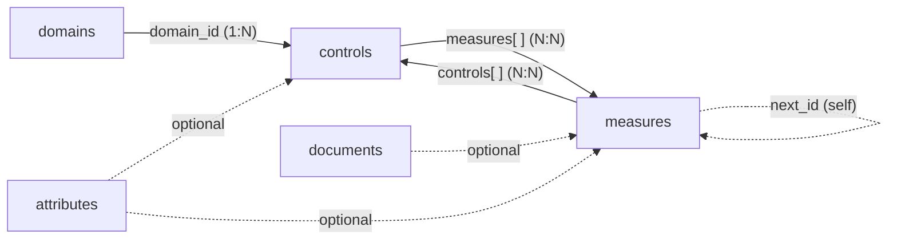
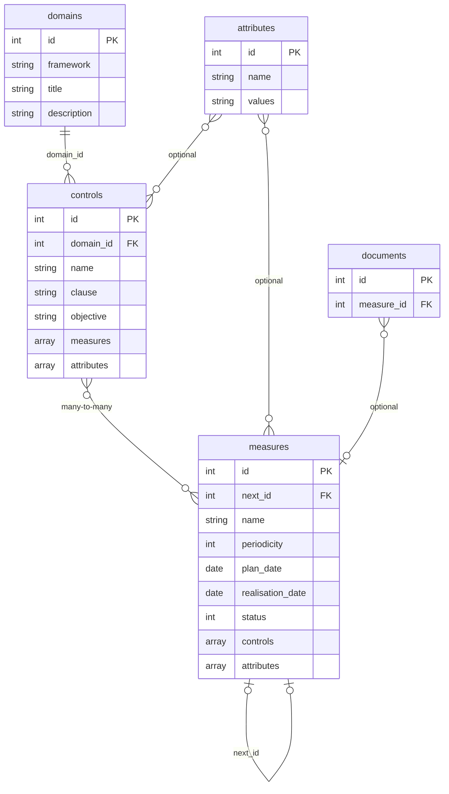

# **Data Model**

The key tables are the following:

- attributes  
- domains  
- controls  
- measures  
- documents  

> **Roles:** `controls` = **security measures** (requirements to implement).  
> `measures` = **audit instances** (periodic verifications of those requirements).

## **Table Dependencies**

Overview: who uses what.



The detailed schema below describes the fields of each table.



The relationships are as follows:

| Link | Type | Description |
| --- | --- | --- |
| `domains` → `controls` | Foreign key (1:N) | Each security measure references its domain via `domain_id` |
| `controls` ↔ `measures` | Many-to-many (bidirectional) | Each security measure lists its audit instances in `measures[]`; each audit instance lists its security measures in `controls[]` |
| `attributes` → `controls` | Optional | The `attributes` field of a security measure may contain a list of attribute IDs |
| `attributes` → `measures` | Optional | Same for audit instances |
| `measures` → `measures` | Self-reference via `next_id` | Allows chaining successive campaigns of the same audit |
| `documents` → `measures` | Optional (1:N) | Documents and evidence are attached to audit instances via `measure_id` |

> **Note:** There is no exposed join table for the controls/measures relationship.  
> IDs are directly embedded in each object on both sides.

---

## **attributes**

Attributes are multi-value classification reference sets.  
Each attribute defines a set of tags (prefixed with `#`) that can be associated with security measures and audit instances.

| Field | Type | Description |
| --- | --- | --- |
| `id` | integer | Unique identifier (PK) |
| `name` | string | Name of the taxonomy (e.g., *Security measures*, *Risk_Level*) |
| `values` | string | List of possible values separated by spaces, each prefixed with `#` (e.g., `#Preventive #Detective #Corrective`) |
| `created_at` | datetime | Creation date (ISO 8601, UTC) |
| `updated_at` | datetime | Last modification date |

Example:

```json
{
  "id": 1,
  "name": "Security measures",
  "values": "#Preventive #Detective #Corrective",
  "created_at": "2026-05-17T20:35:52.000000Z",
  "updated_at": "2026-05-17T20:35:52.000000Z"
}
```

---

## **domains**

Domains group security measures by thematic area.  
Each domain belongs to a regulatory or methodological framework (`framework`).

| Field | Type | Description |
| --- | --- | --- |
| `id` | integer | Unique identifier (PK) |
| `framework` | string | Reference framework (e.g., `NIS2`, `Vulnerability Management`) |
| `title` | string | Domain name (e.g., *NIS2 Governance and Steering*) |
| `description` | string | Description of the scope covered, often with reference to an article or standard |
| `created_at` | datetime | Creation date |
| `updated_at` | datetime | Last modification date |

Example:

```json
{
  "id": 1,
  "framework": "NIS2",
  "title": "NIS2 Governance and Steering",
  "description": "Strategic and operational steering according to Art. 21.1 and 21.2.a",
  "created_at": "2026-05-17T20:35:52.000000Z",
  "updated_at": "2026-05-17T20:35:52.000000Z"
}
```

---

## **controls**

Security measures describe the requirements to be implemented.  
Each security measure belongs to a domain and is verified by one or more audit instances.

| Field | Type | Description |
| --- | --- | --- |
| `id` | integer | Unique identifier (PK) |
| `domain_id` | integer | Reference to `domains.id` (FK, required) |
| `name` | string | Name of the security measure, often with article number (e.g., *Art.21.2.a – Risk Analysis*) |
| `clause` | string | Short identifier of the normative clause (e.g., `NIS2-Art.21.2.a`) |
| `objective` | string | Expected objective of this security measure |
| `input` | string \| null | Data or resources required for implementation |
| `model` | string \| null | Recommended operational model or method |
| `indicator` | string \| null | Structured performance indicator (Target, Frequency, Owner) |
| `action_plan` | string \| null | Associated action or treatment plan |
| `standard` | string \| null | Reference to an external standard (e.g., ISO 27001) |
| `attributes` | array \| null | List of associated attribute IDs; `null` if none |
| `measures` | array | List of audit instance IDs verifying this security measure |
| `created_at` | datetime | Creation date |
| `updated_at` | datetime | Last modification date |

Example:

```json
{
  "id": 1,
  "domain_id": 1,
  "name": "Art.21.2.a - Risk Analysis",
  "clause": "NIS2-Art.21.2.a",
  "objective": "Assessment of threats to critical assets using EBIOS RM or equivalent methodology",
  "input": "List of critical assets, EBIOS RM methodology",
  "model": "Annual analysis according to ISO 27005 or EBIOS RM",
  "indicator": "Target: Residual score ≤ acceptable | Frequency: Annual | Owner: CISO",
  "action_plan": "Risk treatment plan approved by Management",
  "standard": null,
  "attributes": null,
  "measures": [1]
}
```

---

## **measures**

Audit instances describe periodic operational verifications.  
An audit instance checks whether one or more security measures are properly applied.  
It contains planning, execution, and result data.

| Field | Type | Description |
| --- | --- | --- |
| `id` | integer | Unique identifier (PK) |
| `name` | string | Title of the verification |
| `objective` | string \| null | Specific objective of this audit instance |
| `input` | string \| null | Data or evidence required for execution |
| `model` | string \| null | Operating procedure |
| `action_plan` | string \| null | Corrective actions if the audit fails |
| `periodicity` | integer \| null | Frequency in months (e.g., `12` = annual, `3` = quarterly) |
| `plan_date` | date \| null | Planned execution date (`YYYY-MM-DD`) |
| `realisation_date` | date \| null | Actual execution date |
| `observations` | string \| null | Free comments on the result |
| `score` | number \| null | Numeric score from the evaluation; `null` if not yet performed |
| `note` | number \| null | Additional qualitative note |
| `status` | integer | Current status of the audit instance (see below) |
| `next_id` | integer \| null | ID of the next audit instance in the historical chain (self FK) |
| `standard` | string \| null | External normative reference |
| `attributes` | array \| null | List of associated attribute IDs; `null` if none |
| `scope` | string \| null | Scope of application (entity, site, system) |
| `controls` | array | List of security measure IDs verified by this audit instance |
| `created_at` | datetime | Creation date |
| `updated_at` | datetime | Last modification date |

### **Values of the `status` field**

| Value | Meaning |
| --- | --- |
| `0` | To do / Not yet performed (`realisation_date` is null) |
| `1` | Proposed (auditee submitted a result, pending validation) |
| `2` | Done / Completed (`realisation_date` is set) |

Example:

```json
{
  "id": 1,
  "name": "Formal review and signature of the risk analysis",
  "objective": "Management validation of the risk treatment strategy",
  "model": "Executive Committee presentation + formal signature",
  "periodicity": 12,
  "plan_date": "2026-07-31",
  "realisation_date": "2025-03-25",
  "score": null,
  "status": 2,
  "next_id": null,
  "standard": null,
  "attributes": null,
  "scope": null,
  "controls": [1]
}
```

---

## **documents**

The `documents` table stores attachments and documentary evidence associated with audit instances.  
Each document is linked to a `measures` record via `measure_id`.
